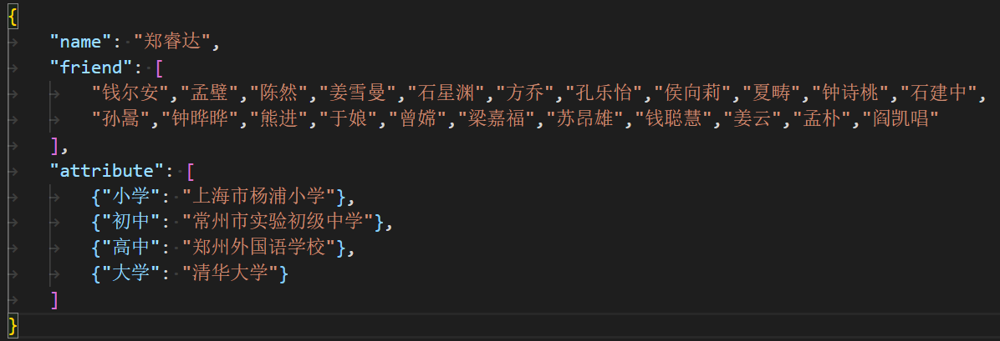
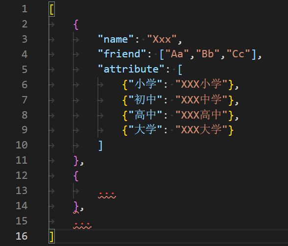
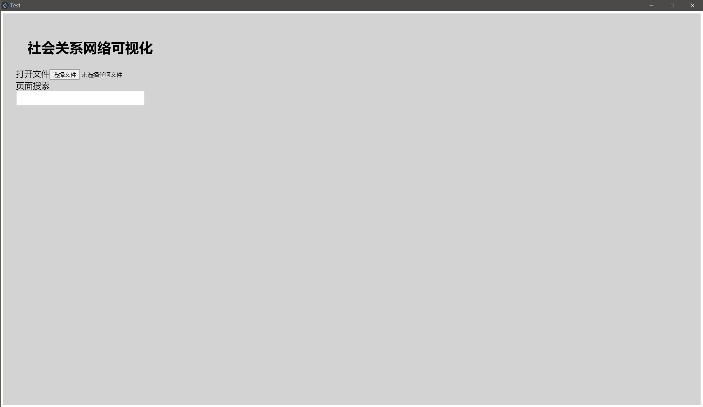
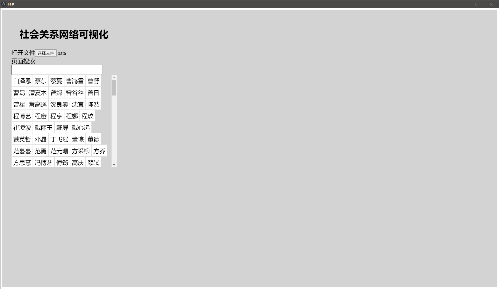
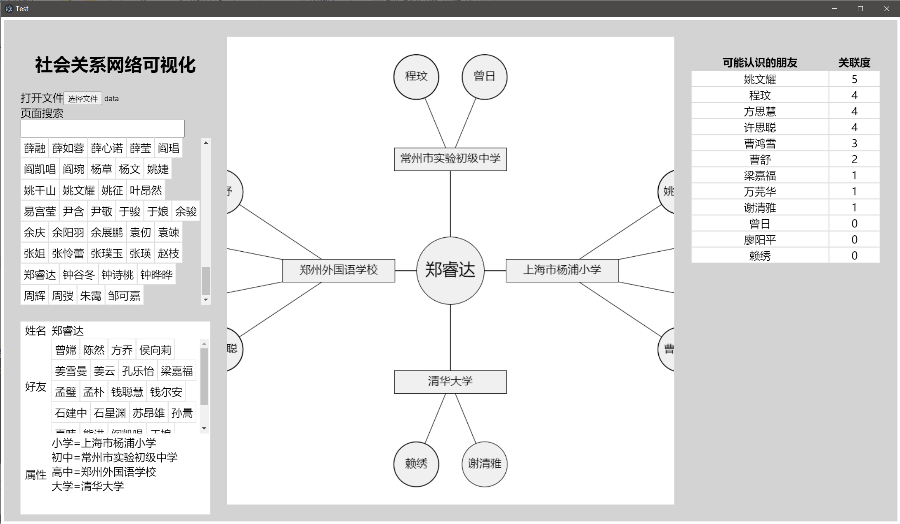
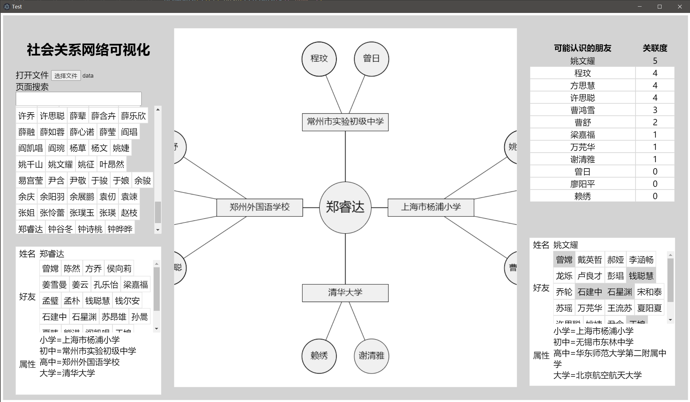

# Social_network_visualization

[toc]

## 简介

这是一个可视化“社会关系网络”的程序，是我的《数据结构与算法设计》的课程设计作业。

这个程序提供以下功能：

- 打开记录了社会关系网络的文件。
- 列出文件中所有个体
- 查看某个个体的姓名、好友和属性（就读的各级学校、工作单位等）
- 图形化展示个体的属性以及拥有相同属性的个体，即（可能认识的人）

## 开发环境

- NodeJS v14.17.3
- electron v13.1.7

## 开始使用

有三种使用方式：

1. 如果已经安装了 nodejs 和 electron 的环境，在项目目录下，输入 `npm run start` 即可开始使用。
2. 可以在 release 里找我打包好的可执行文件 `social_network_visualization.exe`，但只支持了 windows 64位（似乎会弹一个未知发布者对信息进行更改的警告窗）。
3. 直接打开项目目录下的 web/index.html （web目录下的其他文件也需要在一个目录下）。

## 使用指南

### 数据文件结构介绍

数据以文本格式存储。

完全采用一个线性的数据结构。

所有的个人信息以 json 的格式排列与其中。 其中，单个个体的信息结构如图所示（其中的信息都是随机生成，没有任何自然个人 的隐私遭到泄漏）

要求

1. 当 A 为 B 的好友时，B 也必须是 A 的好友
2. 每个个体的 name 字段必须唯一，不能有重名的情况
3. 所有提及的姓名必须拥有一份 json 数据。

而“可能认识的人”为具有相同属性的其余个体，即两人之间可能为同学关系。

整个文件的结构看起来是这样的：

## 打开文件

有了刚刚的文件，就可以开始使用这个程序了。打开后的界面是这样的：

当在表单中提交了文件后，就会显示姓名列表。

新出现的列表为排序后的数据文件中的姓名列表，点击其中的姓名即可显示这个人的个人信息：

其中左下角显示了所选个体的姓名、好友、属性的信息。好友列表已经按照姓名排序，也可以点选——与点选左上的列表拥有相同的功能。

中央显示了其拥有的属性以及拥有相同属性的其他个体。视图可以进行拖拽与缩放等操作。布局经过设计，保证不会因为名字太多出现遮挡、重叠等情况。

右上角显示了个体“可能的好友”列表以及与之的关联度（相同好友个数），以关联度降序排序。

而右上角的好友列表也是可以点击的。点击过后显示这位“可能的朋友的”信息：

与左侧的人物信息栏类似，唯一的区别是右侧的人物的好友栏中共同好友的部分会被标为灰色。

左上角有一个输入框，可以用于搜索姓名。使用起来大概会非常方便。